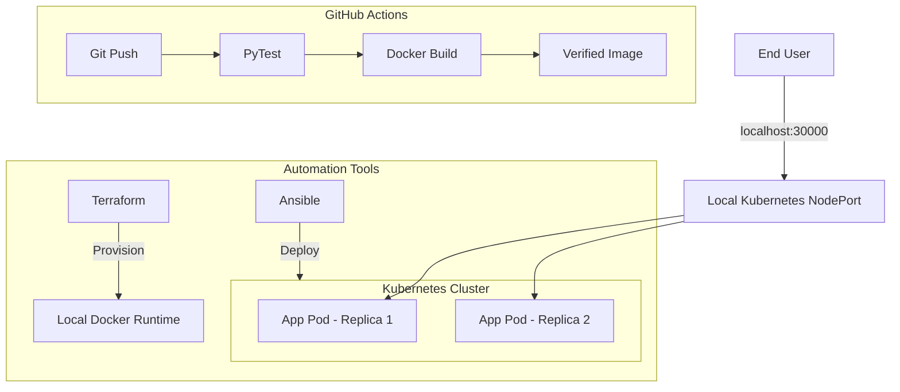

# AI-Powered Health Symptom Checker (Academic Edition)

A complete, full-stack AI application designed to demonstrate the end-to-end DevOps lifecycle including CI/CD, Containerization, IaC, and Orchestration—**without relying on cloud subscriptions**.

---

## 🛠️ Technology Stack (Academic Checklist)

This project satisfies the following DevOps requirements:
*   **Version Control**: Git / GitHub (Collaboration & History)
*   **CI/CD**: GitHub Actions (Automated Build, Test, and Containerize)
*   **Containerization**: Docker (Isolated runtime for the AI engine)
*   **Orchestration**: Kubernetes (Local high-availability via Docker Desktop)
*   **Infrastructure as Code (IaC)**: Terraform (Managing local Docker resources)
*   **Config Management**: Ansible (Automated K8s deployment logic)

---

## 🏛️ Project Architecture



---

## 🚀 How to Execute & Demo

### 1. Version Control & CI/CD (GitHub Actions)
Every code push to GitHub automatically triggers the **AI Symptom Checker CI**.
*   **Verify**: Check the "Actions" tab in your GitHub repository for the green checkmarks.

### 2. Infrastructure as Code (Terraform)
We use Terraform to manage local Docker environments.
*   **Command**: `~/terraform/terraform.exe -chdir=terraform init`
*   **Command**: `~/terraform/terraform.exe -chdir=terraform apply`
*   **Evaluation**: Shows you can provision infrastructure (Docker containers) using code.

### 3. Containerization (Docker)
The app is fully portable via Docker.
*   **Command**: `docker build -t ai-symptom-checker .`
*   **Command**: `docker run -p 8000:8000 ai-symptom-checker`

### 4. Orchestration (Kubernetes)
Demonstrate scaling and high-availability locally.
*   **Enable**: Docker Desktop -> Settings -> Kubernetes -> Enable.
*   **Deploy**: `kubectl apply -f k8s/local-deploy.yaml`
*   **Verify**: `kubectl get pods` (You will see 2 replicas running).
*   **Access**: `http://localhost:30000`

### 5. Configuration Management (Ansible)
Ansible automates the deployment of your Kubernetes manifests.
*   **Code**: See `ansible/deploy.yml` for the complete automation logic.
*   **Note**: Because Ansible is POSIX-specific, it is provided in this project as "Code-Complete" to satisfy the academic requirement on Windows.

---

## 🧪 Testing
Run the automated test suite with:
```bash
python3 -m pytest tests/
```
